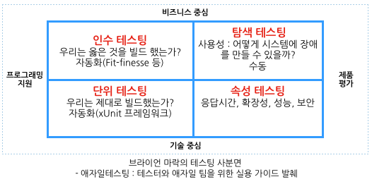

7장 테스팅
=====
세분화된 시스템의 테스팅과 관련된 문제를 해결, 새로운 기능을 자신있게 릴리스할 수 있는 몇가지 해결책 제시
> 수행 가능한 테스트의 종류를 이해하는 것은 대항하는 두 세력, 즉 소프트웨어를 가능한 한 빨리 실환경에 적용하려는 세력과 소프트웨어의 충분한 품질을 보장하려는 세력 사이의 균형을 유지하기 위해 중요하다

 

### 테스트의 종류
  
성능 테스트 및 단위 테스트 
-> 기술 중심의 테스트 / 일반적으로 모두 자동화 
인수테스팅 및 탐색 테스트 
-> UAT(고객에 의한 최종 제품 평가) 시스템 상 사용자 테스팅으로 대표되는 수동 테스팅 
> 시스템을 테스트하는 방법의 측면에서 여러 선택을 해야함 
> 최근 추세는 가능한 많은 자동화를 추구해 대규모 수동 테스트를 탈피 하는 것

현재 대규모 수동 테스트를 수행한다면 마이크로서비스의 길에 더 진입하기 전에 그 문제부터 해결하라고 제안, 소프트웨어를 신속하고 효율적으로 검사할 수 없다면 마이크로서비스가 주는 혜택을 누리지 못하기 때문
***
 

### 테스트의 범위
  
1. 단위 테스트  
일반적으로 단일 함수 또는 메서드 호출을 테스트 
테스트 주도 설계(TDD)의 부산물로 생성된 테스트는 이 범주에 속함 
개발자를 돕는 테스트임으로 비즈니스 중심이 아닌 기술 중심 
__이 테스트의 핵심목표는 기능의 정상 동작 유무에 대한 매우 빠른 피드백 __
__작업을 진행하면서 코드를 재구성하게 해주며, 작은 범위의 테스트들이 우리의 실수를 잡아주기 때문에 코드의 리팩토링을 지원하는데 있어 중요__
2. 서비스 테스트 
사용자 인터페이스를 우회, 서비스들을 직접 테스트 
여러 서비스로 구성된 시스템에 대해 서비스 테스트는 개별 서비스 기능 테스트 가능 
__단위 테스트 보다 더 많은 범위를 다루기 때문에 테스트가 실패할 경우 어떤 부분이 장애를 만들었는지 단위 테스트보다 찾기 어려우나 서비스 세트느는 변경되는 부분이 훨씬 적으므로 넓은 범위 테스트보다 덜 취약__
3. 엔드 투 엔드 테스트 
시스템 전체에 대해 수행하는 테스트(테스트 피라미드에서는 UI) 
수많은 실환경 코드 테스팅을 포함하기 때문에 통과할 경우 실환경에서 잘 동작할 것이라는 강한 확신+안심 
4. 절충안 
피라미드 위로 올라갈수록 테스트한 기능이 제대로 동작한다는 확신이 커지면서 테스트의 범위도 늘어남 
피라미드 아래로 내려가면 일반적으로 테스트가 훨씬 더 발라지므로 더 빠른 피드백을 얻을 수 있음 
__서비스 테스트 또는 엔드 투 엔드 테스트와 같으 ㄴ넓은 범위의 테스트가 실패하면 우리는 그 문제를 발견할 수 있는 빠른 단위 테스트를 작성할 것이다. 이와 같이 피드백 주기를 향상시키도록 지속적으로 노력할 것이다__
5. 얼마나 많은 테스트가 필요할까? 
다양한 종류의 자동화 테스타가 있으며 현재 테스트 수가 문제가 될 수 있음을 이해하는 것이 중요 
* 참고
안티패턴은 테스트 아이스크림콘이나 역피라미드로 언급 
작은 범위의 테스트가 거의 없고 대부분 큰 범위의 테스트 
프로젝트들으 ㄴ빙하처럼 느린 테스트와 아주 긴 피드백 주기를 가지며 테스트가 지속적 통합의 부분으로 수행된다면 많은 빈드를 할 수 없고 빌드 시간의 특성상 한번 빌드가 깨지면 오랜 시간 동안 중단된 채로 남을 수 있음
***
 

### 서비스 테스트 구현하기
서비스 테스트는 전체 서비스에 걸친 한 기능의 단면에 대한 테스트를 원하지만 테스트하려는 서비스와 다른 서비스를 격리하기 위해 다른 협업자 모두를 스텁화하는 몇 가지 방법이 필요하다  
-> 스텁 : 테스트 중인 시스템의 외부 이존성이나 협업자를 대처하는 모의 구현 의미, 다른 컴포넌트와의 로직을 독립적으로 검증
> 서비스 테스트 집합은 하위 협업자를 위한 스텁 서비스를 실행시키여하고 스텁 서비스들과의 연결되는 환경에 고객 서비스를 구성해야 한다. 그런 다음 실환경 서비스를 모방해 응답을 보내도록 스텁을 구성해야 한다.
1. 목 또는 스텁 사용하기
하위 협업자의 스텁 생성을 이야기할 때는 테스트 대상의 서비스가 알려진 요청을 보내면 정해진 응답을 하는 스텁 서비스 생성을 의미  
이 테스트의 변형은 스텁 대신 목(MOCK)을 사용하는 것  
목을 사용할 때는 호출의 수행까지 보장(예상된 호출이 이루어지지 않으면 테스트는 실패) / 목은 예상된 부작용이 발생하는지 확인하는데 유용 
스텁과 목 호출 사이 균형은 민감한 것이라 단위 테스트처럼 서비스 테스트에서도 까다롭기 때문에 일반적으로 서비스 테스트들을 위해 목보다 스텁을 사용
2. 더 영리한 스텁 서비스 
스텁/목 서버를 통해 많은 업무를 줄일 수 있음
***
 

### 까다로운 엔드 투 엔드 테스트
엔드 투 엔드 테스트의 목표는 시스템의 전체적인 관점을 제공하기 위해 사용자 인터페이스를 통해 시스템의 하부 모든 기능을 동작 시키는 것 
-> 엔드 투 엔드 테스트를 구현하기 위해 다수의 서비스를 함께 배포, 그 후에 모든 서비스에 대한 테스트를 수행해야 함 
-> 훨씬 많은 범위를 다루고 시스템 작동에 대해 많은 확신을 갖게 하지만 
이 테스트는 느리고 실패를 분석하기 어렵다 
> 여러 서비스의 파이프라인을 단일 엔드 투 엔드 테스트 단계로 수렴하여 서비스들의 새로운 빌드가 발생될 때마다 엔드 투 엔드 테스트를 수행 
> 서비스가 변경되면 언제라도 그 서비스에 대한 로컬 테스트를 수행, 그 테스트들이 통과되면 통합 테스트를 시작할 것이다.
***
 

### 엔드 투 엔드 테스팅의 단점 / 신뢰할 수 없고 취약한 테스트
1. 누가 이 테스트를 작성하는가?
2. 얼마나 오래 걸릴까?
3. 엄청난 적체
4. 메타버전
***
 

### 스토리가 아닌 테스트 여정
***
 

### 우리를 구할 소비자 주도 테스트
1. 팩트
2. 대화에 관하여
***
 

### 엔드 투 엔드 테스트를 사용해야 하는가?
***
 

### 출시 후의 테스팅
1. 배포를 리리스와 분리하기
2. 카나리아 릴리스
3. MTBF 보다 MTTR?
***

7장 테스팅
=====
  
### 테스트의 종류
***
 

### 테스트의 범위
1. 단위 테스트
2. 서비스 테스트
3. 엔드 투 엔드 테스트
4. 절충안
5. 얼마나 많은 테스트가 필요할까?
***
 

### 서비스 테스트 구현하기
1. 목 또는 스텁 사용하기
2. 더 영리한 스텁 서비스
***
 

### 까다로운 엔드 투 엔드 테스트
***
 

### 엔드 투 엔드 테스팅의 단점
***
 

### 신뢰할 수 없고 취약한 테스트
1. 누가 

### 신뢰할 수 없고 취약한 테스트
***
 

### 교차기능 테스트
1. 성능 테스트
***
 

### 마치며
***
