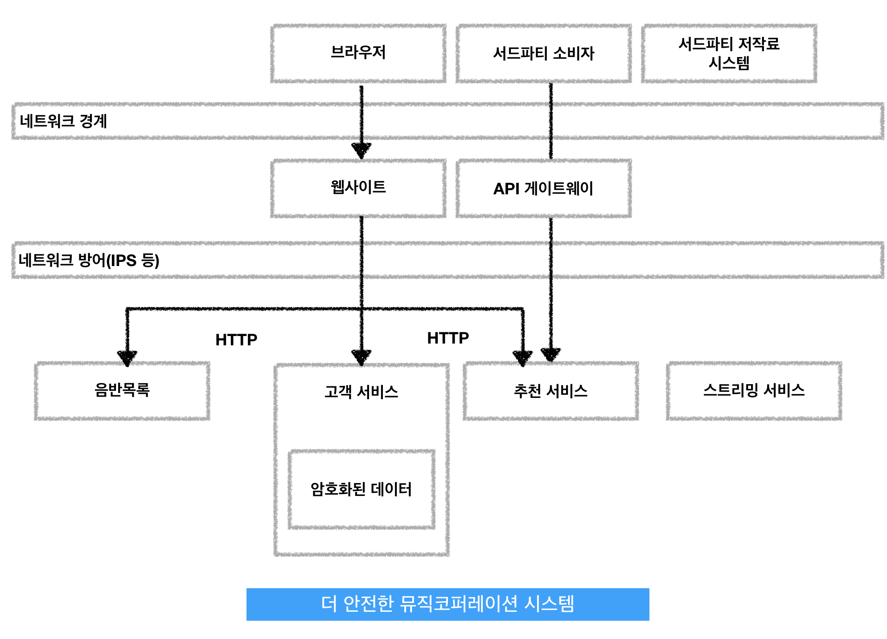

보안
=====
>> 애드워드 스노든의 폭로 사건은 회사가 보유한 데이터의 가치와 우리가 구축한 시스템에 저장된 고객 데이터의 가치에 대한 인식을 높혀주었다.  
>> 이 장에서는 시스템을 설계할 때 고려해야 할 보안적 측면을 간략히 설명한다.
 

## 인증과 권한부여
>> 인증 : 자신이라고 말하는 당사자를 확인하는 과정, 일반적으로 사용자 이름과 비밀번호를 통해 사용자를 인증 
>> 권한 주체 : 일반적으로 인증되는 사람 또는 사물에 대해 추상적으로 말하는 그 대상 
>> 권한 부여 : 권한 주체를 허용된 행위와 매핑하는 매커니즘 (예: 그 사람이 할 수 있는 것과 없는 것을 결정하기 위해 시스템이 사용할 수 있는 일부 정보인 그 사람의 근무부서나 사무실의 정보를 전달받음)
>> 
__1. 일반적인 SSO 구현체__ 
-> 인증과 권한부여에 대한 일반적인 접근 방법은 싱글 사이온(sso) 솔루션을 사용하는 것, 대표적인 구현체인 SAML과 OpenID Connect는 이 분야를 위한 기능 제공 
1> 권한주체가 웹 기반의 인터페이스를 통해 리소스에 접근 시, 그 사람은 인증을 위해 신원제공자에 재전송 
2> 신원 제공자는 그 사람에게 사용자 이름, 비밀번호를 요구하거나 이중 요소 인증과 같은 것을 요구할 수 있음 
3> 신원 제공자는 권한주체의 인증이 충족되면 그 사람의 자원 접근 허용 여부를 결정하도록 서비스 제공자에 정보전달 
SAML - SOAP 기반의 표준이며 지원 가능한 라이브러리와 도구가 있음에도 불구, 작업이 꽤 복잡하기로 유명 
OpenID Connect - OAuth 2.0의 특정 구현에서 출발한 표준이며 구글 및 다른 업체에서는 SSO를 처리하는데 사용, 더 단순한 REST 호출을 사용하고 사용 편의성이 향상되어 기업 시장으로 진출할 것으로 생각되나 신원 제공자의 부족은 가장 큰 장애물 
__2. 싱글 시안은 게이트웨이__ 
마이크로서비스의 설정 내부에서 각 서비스는 신원 제공자를 경유, 핸드쉐이킹을 결정할 수 있지만 여기에는 분명히 중복된 작업이 많을 것이다.  
모든 서비스가 신원 제공자에 대한 핸드셰이킹을 각각 처리하는 것보다 서비스와 외부 세상 사이에서 프록시처럼 동작하는 게이트웨이를 사용할 수 있다. 이 것은 사용자 재전송을 위한 행위를 한 고으로 모아 핸드셰이킹을 수행하는 것이다 
문제점 1) 하위 서비스가 사용자 이름, 역할 같은 권한주체의 정보를 전달하는 방법에 대한 문제를 해결해야 함 2) 인증의 책임을 게이트웨이에 위임하기로 결정했다면 서로 격리된 마이크로서비스가 어떻게 행동할지를 추론하기가 어려워 짐 3) 모든 단계에 대한 보안 조치를 게이트웨이에 의지할 경우 단일 장재 지점이 있을 때 문제 발생
__3. 세분화된 권한 부여__ 
게이트웨이는 상당히 효과적인 큰 단위의 인증 기능을 제공하는 것이 가능 
예) 로그인이 안 된 사용자의 헬프데스크 애플리케이션에 대한 접근 차단
*****
 

## 서비스 대 서비스 인증과 권한부여
프로그램과 서비스가 서로 인증하려면...?
1. 경계 안의 모든 것 허용하기 
특정 경계 내부의 모든 호출을 암묵적으로 신뢰한다고 가정 
-> 일부 조직은 조직의 네트워크 경계선에서 보안을 보장하려 하기 때문에 두 서비스가 서로 통신할 때는 추가로 할 일이 없다고 생각하나 공격자가 네트워크에 침입한다면 전형적인 중간자 공격에 대해 무방비 상태일 것 
조직에서 본 경계 내부를 신뢰하는 가장 일반적인 형태이며 이 트래픽을 HTTPS를 통해 전송할 것은 결정하지만 그 외의 다른 결정은 하지 않음 
-> 이 모델을 사용하는 대부분의 조직에서는 이러한 암묵적인 신뢰 모델이 위험성을 인식한 결정이 아니라 애초에 위험성을 인식하지 않았다는 것이 문제!!!
2. HTTP(S) 기본 인증 
-> 크라이언트가 사용자 이름과 패스워드를 표준 HTTP 헤더에 넣어서 전송, 서버는 상세 내용을 확인하고 클라이언트의 서비스 접근 허용 여부 승인 
네트워크의 어떤 중간자도 헤더 정보와 데이터를 볼 수 있으므로 HTTP 기본인증은 대개 HTTPS 상에서 수행되어야 함 
문제 1) 서버는 자신의 SSL인증서를 관리해야 하는데, 서버가 여러 머신을 관리하는 상황이라면 문제가 될 수 있음 2) SSL을 통해 전송된 트래픽은 바니쉬나 스퀴드 같은 리버스 프록시에 의해 캐시될 수 없음 3) 사용자 이름, 패스워드가 서비스 내부에서 저장될 수 있지만 동작을 복제될 위험이 있음 
유의사항 - 이 접근 방식에서 서버가 아느 ㄴ것은 클라이언트 사용자 이름, 패스워드 뿐이기 때문에 네트워크 상의 어떤 대상으로부터 유입될 수 있으므로 우리가 기대하는 머신에서 온 것인지 알 수 없음
3. SAML 또는 OpenID Connect 사용하기 
클라이언트는 신원 제공자에 자신을 인증하는 데 사용되는 일련의 자격증명을 가지고 있으며 서비스는 세부 인증을 결정하기 위해 필요한 정보를 얻는다 -> 서비스 계정이라 불리는 클라이언트를 위한 계정이 필요하다는 것을 의미 
서비스 계정을 생성하려 한다면 사용 범위를 줄이고 각 마이크로서비스가 자신의 자격증명 셋을 보유하는 것을 고려 -> 자격증명이 누출디더라도 영향을 받은 자격증명 셋만 폐기하면 되기 때문에 자격증명 폐기와 변경을 쉽게 할 수 있음 
문제 1) 기본 인증과 마찬가지로 자격 증명을 안전하게 저장해야 한다 2) 인증 분야의 일부 기술을 코드로 작성하는 것은 까다로운 일이다
4. 클라이언트 인증서 
클라이언트 신원 확인을 위핸 또 다른 방법은 클라이언트 인증서 형태의 전송 계층 보안을 이용하는 것 - 클라이언트와 서버의 연결을 체결할 때 사용되는 X.509 인증서가 각 클라이언트에 설치되어 있으며 서버는 클라이언트 인증서의 진위를 검증, 유효한 클라이언트인지 확실히 보장할 수 있음
5. HTTP 기반의 HMAC 
사용자 이름, 패스워드가 누출되는게 걱정이라면 HTTP 기본 인증은 현명한 선택이 아님 
HTTPS 가 전통적인 대안이나 단점이 많음 - 인증서 관리, HTTPS 트래픽으로 인한 서버 부담 및 트래픽 캐시하기도 쉽지 않음 
다른 대안 - 해시 기반 메시징 코드(HMAC)를 HTTP 요청의 서명에 사용하는 것 
6. API 키 
모든 공개 API는 API키를 사용 -> API 키르 ㄹ통해 서비스는 API 호출자를 인식할 수 있고 호출자의 능력에 제한을 둘 수 있다. 이러한 제한은 단순히 자원에 대한 접근 통제를 넘어 다른 조치로 확장 될 수 있음.  
예) 모두를 위한 서비스 품질을 유지하기 위해 특정 호출자에 대한 속도 제한 
SAML 핸드셰이킹의 처리와 비교, API 키 기반의 인증은 훨신 더 단순/직관적 
7. 대리인 문제 
혼동된 대리인 문제 - 서비스 대 서비스 통신에서 악의적인 당사자가 대리인 서비스를 속여 하위 서비스에 대한 인가되지 않은 호출을 하는 취약점의 한 형태
*****
 

## 보관 중인 데이터 보호하기
>> 화제가 되는 많은 보안 침해 사건은 공격자가 탈취하는 보관 중인 데이터와 연관이 있다. 
>> 이는 데이터가 암호화된 형태로 저장되지 않았거나 근본적으로 결함이 있는 데이터를 보호하는 메카니즘 때문
1. 잘 알려진 것을 사용하라 
__데이터 암호화를 망치는 가장 쉬운 방법은 독자적인 암호화 알고리즘을 구현하거나 심지어 다른 사람의 암호 알고리즘을 구현하는 것__ 
안정된 암호화 알고리즘 구현체 중 검토를 거쳐 정기적으로 패치되는 것을 구해 사용하고 취약점이 발견되었을 때 패치하고 최신 버전을 유지할 수 있도록 선택된 기술에 관한 메일링 리스트나 권고 리스트에 가입하라 
패스워드에 대해서는 솔트를 이용한 패스워드 해싱을 고려 - 잘못 구현된 암호화가 주는 거짓된 안도감은 중요한 것을 은폐하므로 차라리 없느니만 못함
2. 키가 전부다 
데이터 전체를 암호화해도 키를 같은 데이터베이스에 저장하면 도움되지 않음, 그렇다면 키는 어디에 저장을 해야 하는가? 
데이터를 암호화하고 복호화할 보안장치를 분리 
서비스들이 키를 필요로 할 때 접근할 수 있는 분리된 키 금고 이용
3. 암호화 대상 정하기 
모든 데이터를 암호화하는 연산 부하는 결과적으로 더 강력한 하드웨어를 필요로 하여 매우 부담, 이 것은 스키마 리팩토링의 하나로서 데이터베이스를 이전할 때 훨씬 더 어렵다 
알고 있는 테이블 집합에만 암호화 하는 것이 현명한 접근
4. 요구형 복호화 
데이터를 처음 볼 때 그 것을 암호화> 데이터의 요청이 있을 때 복호화하고 복호화된 데이터는 어디에도 저장되지 않도록 한다
5. 백업 암호화하기 
백업은 좋은 것이며 백업 또한 암호화되었는지 확인해야 함 
특정 버전의 데이터를 처리하기 위해 어떤 키가 필요한지도 인지해야 한다는 것을 의미
*****
 

## 심층방어
1. 방어형 
하나 이상의 방화벽을 구축하는 것은 취할 수 있는 매우 현명한 예방 조치. 
방화벽을 다중으로 구축하는 방법도 추천
2. 로깅 
좋은 로깅(특히 다수의 시스템에서 로그를 수집할 수 있는 능력)은 예방을 위한 것이 아니라 나쁜 일의 탐지와 회복에 도움이 될 수 있다 -> 로그를 이용할 수 있게 하는 것은 사후에 어떤 나쁜 일이 발생했는지 알 수 있게 함. 
로그에 저장할 정보에 대해 주의해야 한다는 점!!! -> 민감한 정보는 로그를 통해 중요한 데이터가 누출되지 않도록 선별, 그렇지 않을 경우 결과적으로 로근느 공격자의 아주 좋은 목표물이 될 수 있음
3. 침입 탐지와 방지 시스템 
침입 탐지 시스템(IDS) - 문제가 발견될 때 리포팅하며 수상한 행위에 대해 네트워크와 호스트를 모니터링 
침입 방지 시스템(IPS) - 수상한 활동을 모니터링할 뿐만 아니라 나아가 그것이 발생되지 않도록 한다.  
** 처음부터 시작한다면 IDS가 적합, 
** 이 시스템은 많은 애플리케이션 방화벽처럼 경험적인 방법에 기반, 문제 경보 면에서 더 수동적인 IDS를 사용하면 그 규칙들을 더 적극적으로 적용하기 전에 잘 조율할 기회를 얻게 된다.
4. 네트워크 분리(망 분리) 
모놀로식 애플리케이션에서는 추가 보호를 위한 네트워크를 구성할 수 있는 방법이 제한되어 있지만  
마이크로서비스에서는 서비스들의 상호 통신 방법의 통제를 세분화되도록 서비스들을 다른 네트워크 세그먼트에 배치할 수 있다. 
--> 이를 통해 팀 소유권이나 위험도에 따라 네트워크를 분리할 수 있다.
5. 운영체제 
계정이 누출되더라도 피해를 최소화할 수 있도록 가능한 한 적은 권한을 가진 OS 사용자로 동작하는 서비스로 시작하라 
__소프트웨어를 정기적으로 패치하라__ - 버퍼 오버플로 취약점이 패치되지 않은 구 버전의 웹 서버가 root 권한으로 머신에서 실행되고 있다면 그 시스템도 극도로 취약할 것이다.
*****
 

## 시범예제
>> 세분화된 시스템 아키텍처는 보안을 구현하는 방식에 있어 훨씬 더 많은 자유를 준다. 
>> 민간한 정보, 중요 기능 노출 등에 대해서는 엄격한 보안 규정 조항을 적용하나  
>> 시스템의 다른 부분에서는 우리가 염려하는 수준 안에서 훨씬 느슨한 규정을 적용

  
*****
 

## 절약하라
디스크 공간 비용이 낮아지고 데이터베이스 기능이 향상됨에 따라 대용량 정보 수집과 저장이 급격히 쉬워지고 있음 -> 그렇다면 개인을 식별할 수 있는 정보를 가능한 한 많이 제거해 바로 적용하는 등 쉽게 만들면 어떨까?, 그리고 그 혜택은??
- 저장하지 않다면 훔쳐갈 것도 없다
- 저장하지 않는다면 아무도 달라고 요청할 것도 없다

데이터최소화 - 사업 운용을 수행하거나 현지법을 준수하기 위해 절대적으로 요구되는 만큼만 정보를 저장하는 개념 함축
*****
 

## 인적 요소
조직 내 인적 요소를 다루기 위한 프로세스와 정책 필요
- 악의가 있는 사람의 입장에서 생각하는 것은 필요한 보호 조치를 추론할 수 있는 좋은 방법이며 그 중 일부는 이미 현재 직원 만큼 많은 내부 정보를 보유!
*****
 

## 황금률
- 자체 암호화를 작성하지 마라
- 자체 보안 프로토콜을 고안하지 마라
- 다년간 경험을 가진 암호학 전문가가 아니거나 자체 인코딩을 시도하거나 정교한 암호화 보호를 시도한다면 그 것은 결국 잘못될 것이다
*****
 

## 보안 탑재
보안 문제에 대한 모든 사람의 일반적 인식을 높이는 것이 문제를 줄이는데 도움이 된다.
- 10대 웹 어플리케이션 취햑점 리스트(OWASP Top 10)와 OWASP의 보안 테스팅 프레임워크에 친숙해라
- 크로스 사이트 스크립팅 공격을 찾아내는 것처럼 시스템의 취약점을 탐지할 수 있는 자동화 도구들을 사용(제드 어택 프록시-ZAP-가 가장 좋은 예)
*****
 

## 외부 검증
침투 테스팅과 같은 훈련이 외부에서 수행될 때는 정말로 실제 침투 시도를 흉내낼 수 있다. 또한 팀은 문제와 너무 가까이 있어 스스로 만든 문제를 발견할 수 없다. 더불어 매 릴리스 전 얼마나 많은 검증이 필요한지도 고려해야 할 것이다.
*****
 

## 마치며
>> 마이크로서비스는 잠재적으로 특정 보안 결함을 줄일 뿐만 아니라 민감한 데이터 장소를 위한 더 복잡하고 안전한 방식과 위험도가 낮을 때를 위한 가벼운 방식에 따른 오버헤드를 절충할 방법을 제공
*****
 
