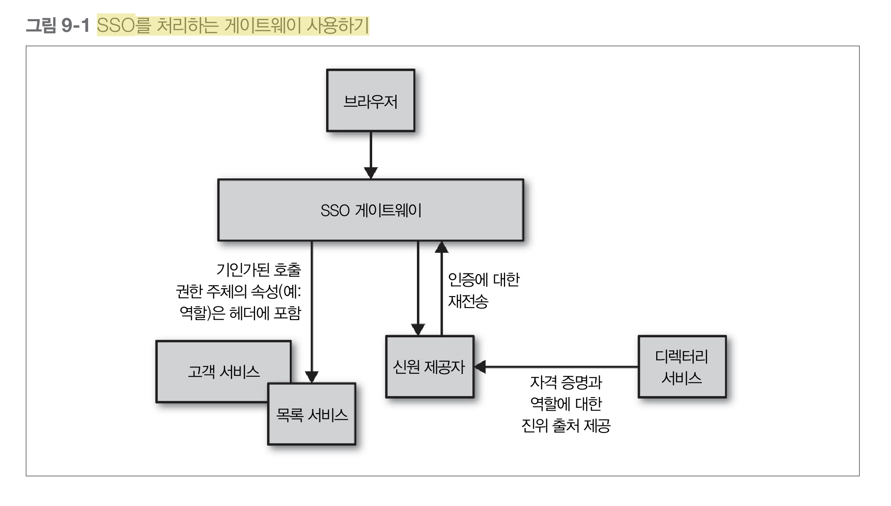

# 9. 보안   

인증(authentication)과 권한부여(authorization)는 시스템과 상호작용하는 인간과 사물에 있어 핵심적인 개념  
보안의 맥락에서 인증은 자신이라고 말하는 당사자를 확인하는 과정  

인증되는 사람 또는 사물에 대해 추상적으로 말할 때 그 대상을 principal로 언급  
**목표는 한 번의 인증으로 모든 시스템을 이요할 수 있는 single identity를 보유하는 것**  

## SSO/Single Sign-On  
예를 들어 어느 컴퓨터에 로그인한 후 그룹웨어 등의 응용 프로그램을 사용할 때에 또 로그인, 다른 서버상의 응용 프로그램을 사용할 때에도 다시 로그인이 필요한 상황이라면, 사용자는 여러 개의 아이디와 비밀번호를 관리해야 한다. 통합인증을 도입한 환경에서는 사용자는 하나의 아이디와 비밀번호로 모든 기능을 사용할 수 있다.  

보안이 필요한 환경에서 통합인증을 도입하는 경우, 여러 응용 프로그램의 로그인 처리가 간소화되어 편리성을 도모할 수 있는 반면, 통합인증의 시작점이 되는, 즉 최초의 로그인 대상이 되는 응용 프로그램 혹은, 운영체제에 대한 접근 보안이 중요하게 된다. 보안위험이 적은 환경에서는 편리성만을 추구하면 되지만, 보안이 요구되는 환경에서는 1회용 비밀번호를 이용하는 등, 이중 인증 등으로 보안을 강화할 필요가 있다.   

업무 시스템이 여러 웹 응용 프로그램으로 사내에 나뉘어 있는 상황이 증가하고 있어, 이에 대해서 통합인증을 제공하는 패키지도 있다. 최근에는 웹 응용 프로그램뿐만 아니라, 단말 에뮬레이터나 클라이언트 서버 모델의 응용 프로그램에 대응되는, 기업용 통합인증 제품이 나와 있다.  

도입시에는 통합인증 대상 응용 프로그램 변경이 필요한지를 고려해야 한다. 응용 프로그램의 변경이 필요한 경우, 도입 비용과 위험이 높아질 수 있다.  

기타 공유 인증 스킴에는 OAuth, OpenID, OpenID Connect, 페이스북 커넥트가 있다. 그러나 이러한 인증 스킴들은 사용자가 다른 사이트나 애플리케이션에 접근할 때마다 로그인 자격정보를 입력해야 하기 때문에 SSO와 혼동되어서는 안 된다.  
[출처 - 위키백과](https://bit.ly/2GELsnr)  

## SAML/Security Assertion Markup Language, 샘엘  
인증 정보 제공자(identity provider)와 서비스 제공자(service provider) 간의 인증 및 인가 데이터를 교환하기 위한 XML 기반의 개방형 표준 데이터 포맷  
SOAP 기반의 표준이며 지원 가능한 라이브러리와 도구가 있음에도 불구하고 작업이 꽤 복잡    
[출처 - 위키백과](https://ko.wikipedia.org/wiki/SAML)  
[SAML에 대해 알아야 할 것들](http://www.itworld.co.kr/tags/70505/OAuth/108736)  

## openID Connect  
openID Connect 는 openid라는 scope 값을 포함해서 Authorization Request를 보내며 Authentication에 대한 정보는 ID Token 이라고 불리는 JSON Web Token(JWT)을 리턴  
OAuth 2.0의 특정 구현에서 출발한 표준  
구글 및 다른 업체에서 SSO를 처리하는데 사용  
더 단순한 REST 호출을 사용하고, 사용 편의성이 향상되어 기업 시장으로 진출    

## LDAP/Lightweight Directory Access Protocol  
기업의 경우에는 흔히 회사의 디렉터리 서비스와 연결될 수 있는 자체 신원 제공자를 보유  
디렉터리 서비스 LDAP, 경량 디렉터리 액세스 프로토콜  

## Okta  
이중 요소 인증과 같은 작업을 처리하는 SAML 신원 제공자 호스팅 서비스지만,  
여러분 회사의 진위 출처 디렉터리 서비스도 연결 가능  

  

## 세분화된 권한 부여  
게이트웨이는 상당히 효과적인 큰 단위의 인증 기능을 제공하는 것이 가능  
로그인이 안 된 사용자의 헬프데스크 애플리케이션에 대한 접근을 차단할 수 있음  
인증의 결과로 게이트웨이가 권한주체에 대한 속성을 추출할 수 있다고 가정하면 보다 섬세한 결정도 가능  
특정 자원 또는 엔드포인트에 대한 접근의 허용 여부는 마이크로서비스 자체에 맡겨야 함  
즉, 어떤 행동의 허용 여부는 마이크로서비스가 더 많이 결정해야 할 필요가 있음  

## HTTP(S) 기본 인증  
HTTP Basic Authentication은 클라이어튼가 사용자 이름과 패스워드를 표준 HTTP헤더에 넣어서 전송  
서버는 상세 내용을 확인하고 클라이언트의 서비스 접근 허용 여부를 승인  
하지만, **안전한 방식으로 사용자 이름과 패스워드를 전송할 수 없으므로 문제가 많음**  
네트워크상의 어떠한 중간자도 헤더 정보와 데이터를 볼 수 있으므로 HTTP 기본 인증은 대개 HTTPS 상에서 수행되어야 함  
HTTPS를 사용하면 클라이언트는 통신하고 서버가 자신이 생각하는 그 서버라는 확실한 보장을 받고  
클라이언트와 서버 간의 트래픽을 도청하거나 페이로 조작을 막는 추가적인 보호도 받음  

## SAML 또는 OpenID Connect 사용하기  
게이트웨이를 사용하고 있다면 네트워크 내부의 트래픽을 게이트웨이로 라우팅해야겠지만  
만약 개별 서비스가 직접 서비스 간 통합을 처리한다면 이 라우팅을 기본적으로 지원해야 함  
기존의 인프라스트럭처를 사용할 수 있고 모든 서비스의 접근 통제를 중앙의 디렉터리 서버에 모아서 처리할 수 있음  
중간자 공격을 피하고자 한다면 여전히 HTTPS 상에서 라우팅해야 함  

## 클라이언트 인증서  
클라이언트의 신원 확인을 위한 또 다른 방법은 (SSL의 계승자인) 클라이언트 인증서 형태의 전송 계층 보안(TLS/Transport Layer Security) 기능을 이용하는 것  
클라이언트와 서버의 연결을 체결할 때 사용되는 X.509 인증서가 각 클라이언트에 설치되어 있으며,  
서버는 클라이언트 인증서의 진위를 검증하여 유효한 클라이언트인지 확실히 보장할 수 있음  

## HTTP 기반의 HMAC  
HTTPS 트래픽이 서버에 부담을 줄 수 있고, HTTPS 트래픽은 캐시하기도 쉽지 않음  
**다른 대안은 OAuth 명세서 일부와 AWS S3 API에 의해 폭넓게 사용되는 해시 기반 메시징 코드(HMAC/hash-based messaging code)를 HTTP 요청의 서명에 사용하는 것**  

### HMAC 장점  
- HMAC에서 요청 메시지 바디는 비밀 키를 사용해서 해시되고 해시 결과는 요청과 함께 전송  
- 서버는 자신이 가진 비밀 키의 복제본을 사용해서 해시를 재생성  
- 1과 2가 일치한다면 서버는 그 요청을 수락  
- 누군가 중간에 요청을 변조한다면 해시는 일치하지 않을 것이고, 서버는 그 요청이 변조되었다는 것을 알 수 있음  
- 비밀 키는 절대 그 요청에 넣어 전송하지 않으므로 통신상에서 누출 될 수도 없음  
- 트래픽이 더 쉽게 캐쉬되고, 경우에 따라 다르겠지만 아마도 해시를 생성하는 부하가 HTTPS 트래픽을 처리하는 것보다 더 낮다는 추가 이점  

### HMAC 단점  
- 클라이언트와 서버 모두 어떤 방식으로든 통신해서 기밀을 공유해야 함  
  - 양단간에 하드코딩할 수 있지만 기밀이 누출된다면 접근을 차단하는 데 문제가 있음  
  - 다른 대체 프로토콜을 통해 통신한다면 여러분은 그 프로토콜이 매우 안전하다는 것도 보장  
- 하나의 패턴이지 표준은 아니므로 다양한 구현 방법이 있음  
  - 그 결과 이 방법에 대한 공객적이며 가용한 양질의 구현체가 부족  
- 제3자가 요청 내용을 조작하지 않았다는 것과 비밀 키 자체의 기밀성(전송하지 않으므로)만 보장하는 것  
  - 요청한 데이터는 네트워크상에서 스누핑하는 사람들에게 여전히 노출  

### API Key  
모든 공개 API는 API Key를 사용함  
API Key를 통해 서비스는 API 호출자를 인식할 수 있고 호출자의 능력에 제한을 둘 수 있음  
단순히 자원에 대한 접근 통제를 넘어 다른 조치로 확장될 수 있음  
모두를 위한 서비스 품질을 유지하기 위해 특정 호출자에 대한 속도 제한을 할 수 있음  
  
마이크로서비스 대 마이크로서비스 방식을 다루기 위해 API Key를 사용하는 정확한 도작 메커니즘은 여러분이 사용하는 기술에 좌우 됨  
일부 시스템은 하나의 공유 API Key를 이용해서 앞에서 설명한 HMAC과 유사한 방식을 사용  
더 일반적 방법은 공개 키와 개인키를 짝으로 사용하는 것  
전형적으로 사람들의 신원을 한 곳에서 관리하듯이 키도 한 곳에서 관리하는데 이 분야에서는 흔히 **게이트웨이** 모델을 사용  
API key 기반의 인증은 SAML 핸드셰이킹 처리와 비교하면 훨씬 더 단순하고 직관적  

---  

**snooping**  
네트워크상의 정보를 획득하는 일련의 행위를 의미  
sniffing도 유사한 의미를 가지지만 주로 염탐하는 행위를 뜻함  
