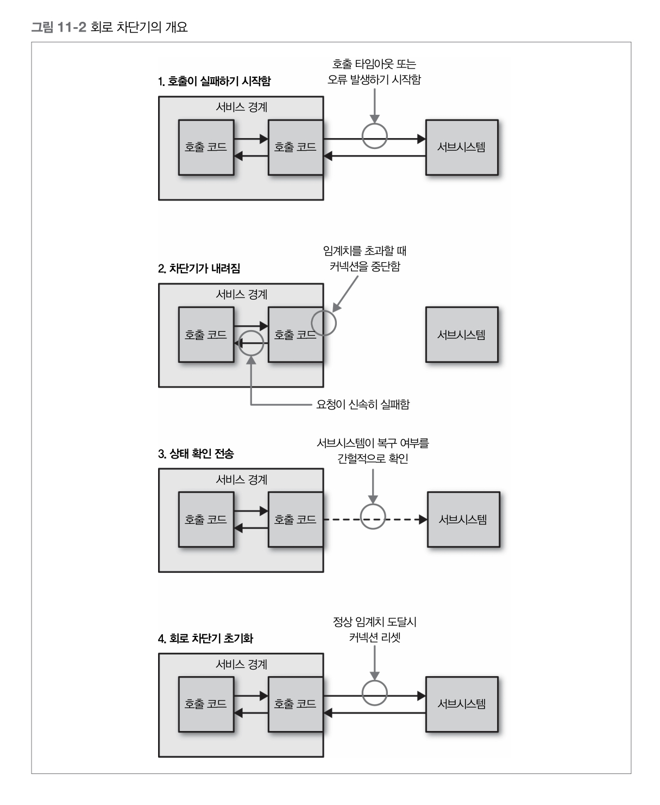
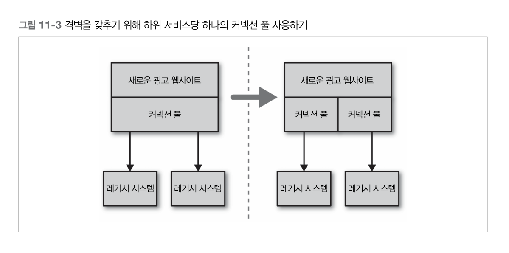
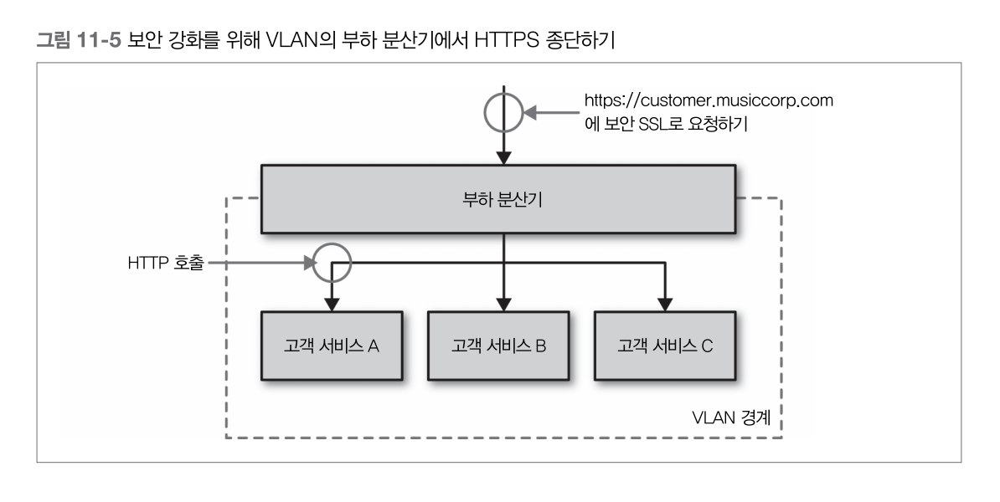
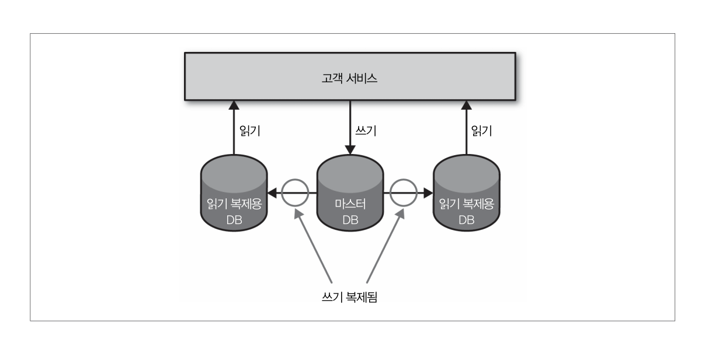

# 11. 대규모 마이크로서비스  
## 분산 컴퓨팅의 오류  
분산 컴퓨팅에서 아키텍트나 설계자가 범하기 쉬운 7가지 가정을 소개했고,  
그 후 제임스 고슬링이 다른 오류를 추가해서 분산 컴퓨팅의 8가지 오류로 알려짐  

> 어떤 것이든 고장날 수 있다는 가정을 명심하는 것은 문제의 해결 방법을 다르게 생각하도록 만든다    

## AntiFragile  
넷플릭스는 안티프래질 조직의 개념을 형성   
넷플릭스가 전적으로 AWS 인프라스트럭처에 기반한다는 사실   
-> 이 두 요소는 장애를 잘 수용해야 한다는 것을 의미, 장애를 일부러 유발    
구글은 매년 장애 복구 테스트(Disaster Recovery Test, DiRT) 훈련  

### Chaos Monkey  
하루 중 특정 시간 동안 임의로 머신의 전원을 꺼버림   
실운영 환경에서 이런 사고의 발생 가능성을 인지하는 것은 시스템을 만드는 개발자들이 실제로 그 사고에 준비하게 만듬  
넷플릭스의 장애를 만드는 봇인 유인원 부대의 일부   

### Chaos Gorilla  
전체 가용성 센터(AWS의 데이터 센터에 해당되는)를 검토하는 데 사용    

### Latency Monkey  
머신 간의 느린 네트워크 접속 상황을 시뮬레이션 함  

> 결국 모든 것은 고장남    

## Timeout  
모든 프로세스 경계 외부의 호출에 타임아웃을 넣고 항상 기본 타임아웃 시간을 설정할 것  
타임아웃 발생 시간을 로깅하고 어떤 일이 발생했는지 살펴보며 타임아웃을 적절히 변경할 것  

### 하위 시스템이 실제로 다운될 때까지 얼마나 오래 기다릴 수 있을까?
- 호출이 실패했다고 판단하는데 너무 오래 걸리면 전체 시스템이 느려질 수 있음   
- 혹은 너무 빨리 타임아웃하면 동작했을지도 모르는 호출을 실패로 고려할 것   

## Circuit Breaker  
가정마다 전련 급등으로부터 가전 기기를 보호하기 위한 회로 차단기(Circuit Breaker)  
  

회로 차단기의 구현 방법은 실패한 요청의 의미에 따라 다름   
HTTP 커넥션을 위한 차단기를 구현할 때는 타임아웃이나 5XX HTTP 응답 코드에 해당되는 호출 실패를 설정   
하위 자원이 다운되거나 타임아웃되거나 에러를 리턴할 때 특정 임계값에 도달 한 후 자동적으로 전송 트래픽을 중지시키고 신속히 실패하도록 만듬    
정상으로 복구되었을 때 자동으로 재시작할 수 있음   

### 회로 차단기가 끊어진 동안 할 수 있는 옵션  
- 요청을 큐에 넣어두고 나중에 처리하는 것  
	- 비동기 작업의 일부로 작업을 수행한다면 효과적  
- 호출이 동기 체인의 일부분으로 수행되는 경우에는 빨리 실패하는 것이 더 나음  

## 격벽  
소프트웨어 아키텍처 측면에서 고려할 수 있는 다양한 격벽이 있음  
각각의 하위 커넥션마다 다른 커넥션 풀을 사용해야 한다  
이것은 특정 하위 서비스가 느려지게 되더라도 그 서비스의 커넥션 풀에서만 영향을 받고 다른 호출은 정상 처리되는 것을 보장  

  

우려되는 것을 분리하는 것도 격벽의 한 방법  
-> 얽혀 있는 기능을 분리된 마이크로서비스로 분해함으로써 우리는 한 지역의 장애가 다른 지역에 영향을 줄 가능성을 줄임  

## 멱등성  
연산이 연속적으로 여러 번 적용되더라도 첫 적용 후의 결과가 달라지지 않는 성질의 연산  

## 부하 분산  
부하 분산기 뒤에 마이크로서비스 인스턴스가 실행되는 여러 호스트를 배치하는 것  
고용량 고비용의 하드웨어 장비에서 모드 프로식와 같은 소프트웨어 기반의 것까지 그 형태와 크기가 다양  

###  SSL termination  
분산기로 유입되는 HTTPS 커넥션을 HTTP 커넥션으로 변환해서 인스턴스에 전달  
과거에는 SSL을 관리하는 부하가 상당히 높아 이 변환 과정을 처리하는 부하 분산기를 두는 것이 매우 유용했으나,  
요즘 이런 일은 인스턴스가 동작하는 개별 호스트를 셋업하는 것만큼 단순함  
  

HTTPS를 사용하는 것은 요청이 중간자 공격에 취약하지 않게 만들기 위한 것이므로,  
SSL 종단 기능을 사용하면 우리 자신을 잠재적으로 어느 정도 노출하는 것   
-> Virtual Local Area Network 안에 모든 마이크로서비스 인스턴스를 두는 것  

### VLAN  
가상 지역 네트워크로 외부와 격리되어 있어 외부의 요청은 라우터를 통해서만 유입  
이 경우에는 라우터가 SSL을 종단하는 부하 분산기가 됨  
VLAN 외부의 커뮤니케이션은 HTTPS로 하지만 내부에서는 모두 HTTP를 사용  

### ELB / Elastic Load Balancer   
AWS는 HTTPS 종단 기능이 있는 부하 분산기를 ELB형태로 제공   
VLAN을 구현하기 위해 AWS 보안 그룹이나 가상 사설 클라우드 (VPC/Virtual Private Cloud)를 사용   

## 데이터 확장  
### Standby Replica Database  
마스터 데이터베이스에 저장된 모든 데이터가 대기 복제 데이터베이스에 복사됨  
마스터 DB가 다운될 경우 데이터는 안전하지만,  
그렇더라도 마스터 DB를 백업으로 바꾸거나 레플리카를 마스터DB로 승격시키는 매커니즘 없이는 DB가용성을 얻을 수 없음  

### Read Replica  
  

### 쓰기용 확장 - Sharding  
샤딩을 통해 많은 DB Node를 가질 수 있음   
저장할 데이터의 일부를 가지고 해싱 함수를 통해 데이터의 키를 생성하며 해싱 함수의 결과인 그 키를 사용해서 저장할 장소를 얻음  

### MongoDB - Map/Reduce  
모든 샤드에 질의하고 싶다면 각각의 샤드에 질의하고 메모리에서 조인하거나 여러 데이터셋이 있는 다른 읽기 전용 저장소가 필요  
여러 샤드에 대한 잦은 질의는 캐시 결과를 사용해서 비동기적 매커니즘으로 처리

### Casandra  
백그라운드에서 데이터의 재조정을 수행하면서 라이브 시스템에 샤드 추가를 지원  
기존 클러스트에 샤드를 추가하는 것은 심약한 사람에게 맞지 않으므로 철저한 테스트를 잊지 말라  

## Caching  
연산의 이전 결과를 저장해서 연속된 요청은 재연산을 위한 시간과 자원의 소비 없이 저장되어 있는 값을 사용할 수 있다  
대개 캐싱은 결과를 더 빠르게 제공하기 위해 DB나 다른 서비스까지의 불필요한 왕복을 제거함  
HTTP가 확장을 매우 잘하는 이유는 캐싱의 개념이 내장되어 있기 때문  

### Client side Caching  
클라이언트가 새로운 복사본을 가져올 시점과 여부를 결정  
하위 서비스가 힌트를 제공하며 클라이언트는 그 응답을 통해 해야 할 것을 이해하고 새로운 요청의 시점과 여부를 알 수 있음   
	- 네트워크 호출을 대폭 줄임   
	- 서버의 하위 서비스에 대한 부하를 줄일 수 있는 가장 빠른 방법   

### Proxy Caching  
클라이언트와 서버 사이에 프로식스를 배치하는 것  
	- Reversed Proxy
		- 스퀴드, 바니시처럼 모든 HTTP Traffic을 캐시  
	- CDN / Content Delivery Network   
클라이언트와 서버에 독립적  
기존 시스템에 캐싱을 추가하는 가장 간단한 방법  

### Server side Caching   
- Redis
- Memcached   
- In-memory Cache   

## Swagger  
스웨거를 사용할 경우 API를 잘 기술하면 웹 브라우저를 통해 API 문서를 볼 수 있고 API와 상호 작용할 수 있는 웹 UI를 생성할 수 있음  
