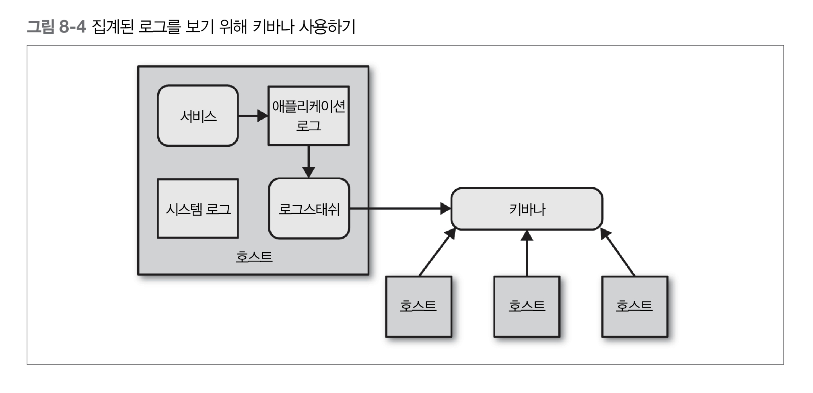

# 8. 모니터링  

모놀리식 애플리케이션의 세계에서는 적어도 분석을 시작할 아주 명확한 지점이 있고,  
단일 장애 지점(single point of failure)이 있다는 것은 장애 분석을 다소 쉽게 만듬  

단일 서버/서비스, 다수 서버/서비스 등이 만드는 모든 것을 취합하고 세부 분석을 할 수 있어야 함  
로그부터 애플리케이션 측정지표까지 가능한 한 많은 수집과 집중식 취합을 하는 것  

## logstash  
많은 로그 파일 포맷을 파싱하고 추가 분석을 위해 하부 시스템에 전송할 수 있음  

## Kibana  
로그를 보기 위한 일레스틱서치 기반 시스템(Elastic Search-backed system)  
로그 검색을 위한 질의 구문(query syntax)과 특정 날짜와 시간 범위 또는 일치하는 문자열으르 찾기 위한 정규식도 사용할 수 있음  
전송된 로그에서 그래포도 생성 가능, 시간에 따라 얼마나 많은 에러가 발생했는지 한번에 보는 것이 가능  

## Metrics  
복잡한 환경에서는 서비스들의 인스턴스가 매우 빈번히 프로비저닝되기 때문에  
우리가 선택한 시스템이 새로운 호스트로부터 측정지표를 매우 쉽게 수집하기 원함   

## Graphite/그래파이트  
평균 CPU 부하와 같이 전체 시스켐에 대해 집계된 특정 측정지표를 볼 수 있기를 기대하지만  
특정 서비스에 대한 모든 인스턴스나 개별 인스턴스에 대한 측정지표까지도 집계되기 원함  
이러한 구조를 추론할 수 있도록 메타데이터와 측정지표를 연결할 수 있도록 매우 쉽게 만들어주는 시스템  

단순한 API를 제공해서 실시간으로 측정지표를 전송할 수 있고 현재 상황을 보여주는 차트나 다른 형태의 디스플레이를 생성하기 위해 그 측정지표에 대한 질의도 할 수 있음  
여러 표본을 취합하고 한 표본을 따라 자세히 검색함으로써 전체 시스템, 서비스 그룹 또는 단일 인스턴스에 대한 응답시간을 알 수 있음  

## 상관관계 ID  
stack strace로 한 것처럼 상향 호출 체인을 추적할 수 있음  
첫 호출이 이뤄질 때 호출에 대한 전역 호출 식별자(GUID, globally unique identifier)를 생성  
후속하는 모든 호출에 전달 -> 로그 레벨이나 날짜와 같은 구성 요소와 함께 구조화된 방식으로 로그에 넣을 수 있음  

  
  

하지만 처음부터 상관관계 ID가 있어야만 분석할 수 있는 문제를 접하기 전까지 상관관계 ID의 필요성을 모른다는 것!  

## 통합 모니터링  
시스템간의 통합 지점을 모니터링하는 것이 중요  
각 서비스 인스턴스는 데이터베이스부터 협업하는 다른 서비스에 이르기까지 하위 의존성 상태를 추적하고 노출  
모니터링은 표준화가 매우 중요한 분야  
많은 인터페잇를 이용하는 사용자에게 기능을 제공하기 위해 다양한 방식으로 협업하는 서비스들이 있다면 총제적인 방식으로 시스템을 바라볼 수 있어야 함  
- 표준 포맷으로 로그를 출력  

   
    
---  
**cascading failure/장애 전파**  
처음에 한 파트에서 발생한 장애가 연속하는 다른 파트에 장애를 촉발시키는 것  
상호 연결된 파트의 시스템에서 발생 할 수 있음  
이와 같은 장애는 전력 송출, 컴퓨터 네트워킹, 금융, 인체 시스템과 같은 다양한 종류의 시스템에서 발생 가능  

**Netflix's Hystrix**  
지연시간 및 장애 내성 로직을 추가하여 분산 환경 서비스들 간의 상호작용을 통제하는 라이브러리  
서비스 사이의 포인트를 격리하고 전파 장애를 막아 시스템의 회복력을 향상시킴  

**Netflix's Suro**  
넷플릭스의 데이터 파이프라인 플랫폼  
사용자 행위의 데이터와 애플리케이션 로그처럼 보다 시스템 운영적인 데이터와 연관된 두 지표 모두를 처리하는 분명한 용도  
Apache Chukwa를 기반으로 자사의 분산된 애플리케이션 서버에서 쏟아지는 엄청난 데이터를 수집해서  
S3나 하둡 파일 시스템 같은 저장소에 저장하여 실시간 분석을 도와주는 오픈 소스 플랫폼  

   
    
